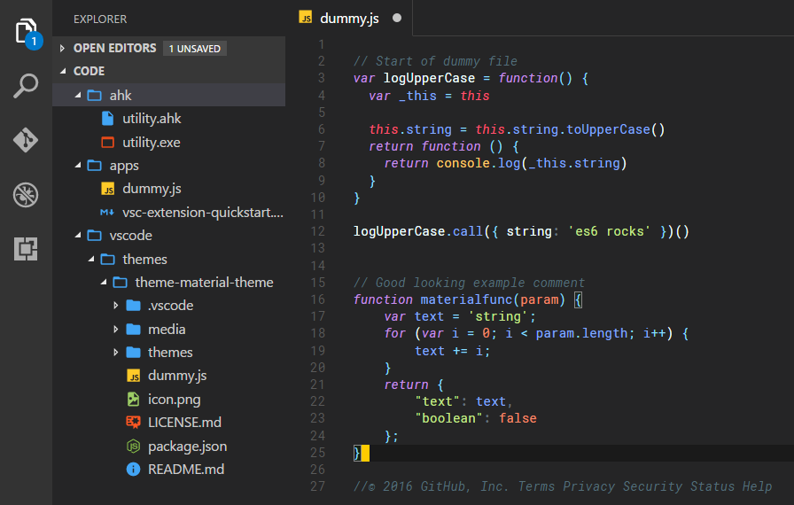
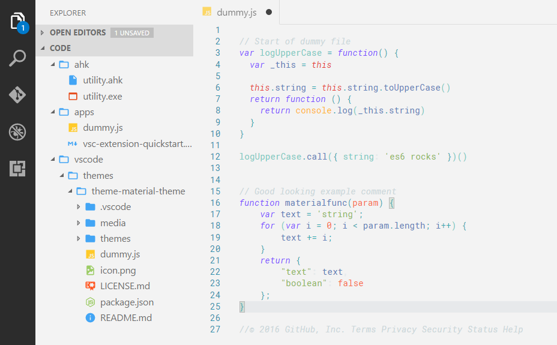

# Sublime Material Theme
#### All credit goes to [Mattia Astorino](https://github.com/equinusocio/material-theme) for originally developing this amazing theme for sublime text. 

This is simply a port to align the style of the theme with the default VSCode chrome that cannot be changed atm. 

* [The original github repo](https://github.com/equinusocio/material-theme)

## Dark
---

## Light 
---

If you have any change requests feel free to create an issue [here](https://github.com/JarvisPrestidge/VSCode-Material-Theme/issues).

And follow me on [Github](https://github.com/JarvisPrestidge)!

**Enjoy :)**